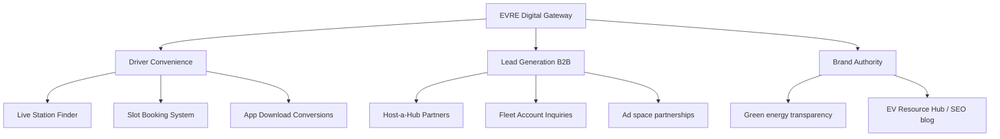

# EVRE Charging Hub: Business Research & Website Blueprint
*Prepared by Antigravity Business Consulting Group*

This blueprint defines the strategic, operational, and technical foundation for the online presence of **EVRE Charging Hub**, a premium Electric Vehicle (EV) charging network. 

---

## 1. Business Overview

**EVRE Charging Hub** is a premium, next-generation electric vehicle charging station network designed to address the infrastructure gaps in the rapidly expanding EV market. Unlike traditional, utility-focused charging spots, EVRE blends ultra-fast charging technology with premium lifestyle amenities.

### Core Value Proposition
> **"Charge your car. Recharge yourself."**
> EVRE provides 100% green-energy-powered, ultra-fast charging (up to 350kW) coupled with premium customer lounges, high-speed Wi-Fi, work desks, and gourmet cafes, transforming a chore (charging) into a productive, pleasant experience.

### Target Segments
1. **Urban EV Owners:** Drivers without home-charging access (e.g., apartment renters, street-parkers) who need fast, reliable charging close to home.
2. **Commercial Fleets:** Delivery services, logistics companies, taxis, and rideshare drivers who require minimal downtime and structured fleet pricing.
3. **Long-Distance Travelers:** Interstate commuters needing ultra-fast DC charging and restful rest-stop experiences.
4. **B2B Partners (Hosts):** Property owners, shopping mall developers, and parking garage operators looking to generate revenue by hosting EVRE chargers.

---

## 2. Customer Pain Points & EVRE Solutions

| Customer Pain Point | EVRE Solution |
| :--- | :--- |
| **Range & Charger Anxiety**<br>Drivers fear arriving at a charger only to find it out-of-order, occupied, or incompatible. | **Real-Time Web Locator & Live Booking**<br>Real-time charger health monitoring and an advanced reservation system that guarantees a slot on arrival. |
| **Charging Downtime Boredom**<br>Waiting 30–60 minutes in a dark, cold parking lot is unpleasant. | **Premium Amenities Lounge**<br>Integrated secure lounges with high-speed Wi-Fi, workstations, clean restrooms, and premium food & beverage partnerships. |
| **Variable / Slow Speeds**<br>Many public chargers are slow level 2 chargers, taking hours. | **Ultra-Fast 350kW DC Chargers**<br>State-of-the-art liquid-cooled chargers providing 100-200 miles of range in just 10–15 minutes. |
| **Confusing Payment Systems**<br>Different RFID cards, apps, and memberships required at every station. | **Seamless Open Payments & App Sync**<br>Tap-to-pay credit/debit card support, unified RFID keys, and single-click mobile wallet integration. |
| **Inaccurate Environmental Impact**<br>Drivers want to see how much carbon they are saving, but metrics are missing. | **Carbon Offset Calculator & Personal Impact Tracker**<br>Real-time reporting of CO2 offsets, gamified for individual drivers and commercial fleets. |

---

## 3. Website Goals

The EVRE Charging Hub website must serve as the digital gateway for drivers and businesses, achieving several key milestones:



- **Maximize App Downloads:** Direct users to iOS and Android applications via QR codes and mobile landing pages.
- **Drive High-Value Leads:** Capture commercial fleet contracts and premium host locations.
- **Provide Instant Utility:** Provide a live status map of chargers so drivers can make decisions immediately.
- **Establish Sustainability Leadership:** Showcase the carbon offset statistics and 100% green energy sourcing.

---

## 4. Customer Journey (Web-Centric)

### Stage 1: Discovery (SEO / Maps)
- **Action:** A driver searches for "DC fast charger near me" or sees an EVRE Hub on Google Maps.
- **Web Touchpoint:** Arrives at the **Station Locator** or **Homepage** on their mobile device.

### Stage 2: Evaluation (Information Gathering)
- **Action:** The driver checks the station details page for charging speed (kW), connector types, prices, and amenities.
- **Web Touchpoint:** Station Detail pages showing: *"3 of 4 CCS chargers available (350kW). Coffee shop open. Lounge Wi-Fi speed: 150 Mbps."*

### Stage 3: Conversion (Reservation or App Download)
- **Action:** The driver decides to visit the hub but wants to guarantee their slot.
- **Web Touchpoint:** Clicks **"Reserve Slot"**, logs in/registers, inputs arrival time, and reserves Charger #2. Web displays a QR code and a button: *"Add to Apple Wallet"* or *"Download App for directions & automatic plug-and-charge."*

### Stage 4: Visit & Post-Visit (Engagement & Loyalty)
- **Action:** Driver charges car, enjoys the lounge, receives receipt, and views their eco-stats.
- **Web Touchpoint:** Receives email with receipt and link to their **Customer Dashboard** showing: *"You saved 14.5 kg of CO2 on this trip!"*

---

## 5. Website Structure (Sitemap)

```
├── Homepage (Hero, Live Map Preview, Value Props, App Promotion)
├── Find a Hub (Full-screen Interactive Map with Filters)
│   └── Hub Details (Dynamic routing page e.g. /hubs/downtown-express)
├── Solutions (B2B)
│   ├── Fleet Management (Logistics, delivery, rideshare hubs)
│   └── Host a Charger (Commercial real estate partnership)
├── Pricing & Loyalty (Membership plans, charging rates, credit rewards)
├── Sustainability (Carbon offset trackers, green grid certification)
├── Resource Center (EV blogs, charging guides, community forum)
└── Company
    ├── About Us (Our green vision, team, careers)
    └── Contact & Support (Helpdesk, corporate inquiry, reporting a broken charger)
```

---

## 6. Pages Required

1. **Homepage:** A highly dynamic landing page showcasing an interactive live tracker, app CTAs, key amenities, and fleet offerings.
2. **Find a Charger (Interactive Locator):** Full-bleed map interface using Leaflet/Google Maps, featuring side panel filtering (speed, connector type, amenities, availability status).
3. **Hub Detail Page (Dynamic):** Dedicated page for each physical location, optimized for local SEO. Contains live station statuses, address, directions, tariff table, nearby amenities list, and driver reviews.
4. **Fleet Solutions:** Tailored B2B landing page highlighting bulk pricing, smart charging schedules, telemetry reports, and API integrations.
5. **Host-a-Hub Partnerships:** High-converting B2B landing page featuring a "Revenue Estimator" tool for land/property owners.
6. **About & Green Impact:** Telling the brand story—our commitment to 100% solar and wind grid integration. Displays real-time cumulative CO2 offset counters.
7. **Pricing, Membership & EVRE Pass:** Details of pay-as-you-go vs. monthly subscription tiers (e.g., EVRE Gold, EVRE Platinum) offering discounted charging rates.
8. **Contact & Support:** Dynamic form system to route inquiries to "Corporate Sales," "Technical Support," or "Site Maintenance."

---

## 7. Features Required (Functional Specifications)

- **Live Charger Status Engine:** Websocket-driven dashboard showing live charger state (Available, Charging, Offline, Reserved) so drivers don't waste trips.
- **Interactive Booking Calendar:** Micro-app widget allowing users to select a date, time slot, and charger type, generating a booking reservation code.
- **Cost & Carbon Calculator:** Interactive slide-based calculator. User enters their daily mileage and vehicle type; the tool outputs their monthly fuel savings ($) and carbon footprint reduction (kg CO2).
- **Interactive Host Revenue Estimator:** Slide-bar widget for potential partners to input parking spaces and average traffic, calculating estimated monthly host revenue.
- **Auth & Driver Dashboard:** A secure client portal where registered drivers view their charging history, active reservations, linked payment methods, and cumulative carbon offset badges.

---

## 8. Competitive Advantages

> [!TIP]
> Emphasizing these five pillars in copy and visuals will differentiate EVRE from legacy networks like ChargePoint or Electrify America:

1. **The "Lounge-First" Philosophy:** No more waiting in dark parking lots. Secure, heated/cooled spaces with workspaces, coffee, and clean restrooms.
2. **True Guaranteed Bookings:** While other networks are first-come-first-served, EVRE allows drivers to secure slots in advance.
3. **100% Renewable-Powered:** Sourced exclusively via on-site solar canopies and verified Renewable Energy Certificates (RECs).
4. **True Plug-and-Charge (ISO 15118):** Car is recognized automatically upon plugging in, pulling payment details from the driver's profile without requiring app launches or card swipes.
5. **Real-time 24/7 Diagnostics:** Automated self-healing chargers that detect issues and deploy technicians immediately, guaranteeing 99.9% uptime.

---

## 9. Call-To-Action (CTA) Strategy

A dual-track CTA funnel is necessary to convert both retail drivers and B2B clients:

### Primary CTAs (Retail Drivers)
- **"Find a Station Near Me"** (Sticky header button, high-contrast brand color)
- **"Download EVRE App"** (App store badges in the hero section and floating mobile banners)
- **"Reserve Your Slot"** (On locator search results and individual station pages)

### Secondary CTAs (B2B Partnerships)
- **"Request Fleet Proposal"** (Targeting commercial logistics coordinators on the Fleet page)
- **"Estimate Your Host Revenue"** (Targeting retail/office developers on the Host page)
- **"Get the EVRE Pass"** (Targeting daily commuters on the Pricing page)

---

## 10. Lead Generation Opportunities

To drive organic B2B growth and consumer loyalty, the website will employ:

- **The Host Revenue Calculator:** Property managers input details (e.g., parking capacity) and receive a customized PDF report via email, capturing high-quality B2B real estate leads.
- **Fleet Optimization Assessment:** Fleet managers fill out an inquiry form regarding their logistics operations to receive a free smart charging optimization schedule proposal.
- **"EV Commuter Guide" Lead Magnet:** A downloadable e-book detailing state-level tax incentives, EV rebate policies, and urban charging hacks, target-capturing consumer emails.
- **Newsletter - "The Green Grid":** Weekly digest featuring EV industry news, new station launches, and member-exclusive discount codes.

---

## 11. SEO Strategy

### On-Page SEO
- **Localized URL Architecture:** `/hubs/state/city/station-name` (e.g., `/hubs/ca/los-angeles/downtown-lounge-5th`).
- **Structured Schema Markup:** Implement `ChargingStation` JSON-LD schema on all station-specific pages to feed rich snippets directly into search engines (showing charger count, price, and current availability live on Google).
- **Core Web Vitals:** Guarantee fast page loads using Next.js image optimization, static page regeneration (ISR) for station profiles, and minimal client-side bundle sizes.

### Content Strategy (Keywords & Hub)
- Focus on high-intent transactional search terms:
  - `electric car charger near me`
  - `dc fast charger reservation`
  - `commercial EV fleet charging solutions`
  - `monetize parking lot with EV chargers`
- Authoritative content guides: *"How to maximize EV battery life when DC fast charging"*, *"Understanding CCS vs NACS plugs in 2026."*

---

## 12. Mobile App Integration Opportunities

The web experience acts as a friction-free onboarding funnel for the EVRE Mobile App:

- **Smart App Banners:** Standardized iOS Smart App Banners and Android equivalent to prompt immediate app installs upon loading the site on mobile devices.
- **Seamless QR Code Onboarding:** Dynamic QR codes generated on the web booking confirmation page that allow users to transfer their reservation seamlessly to their mobile app with a single scan.
- **Deep-linking Navigation:** Web locator buttons (e.g., "Navigate to Station") will automatically open in Google Maps/Apple Maps, or deep-link directly into the EVRE app navigation module.
- **Unified Profile Sync:** Users can log into the web dashboard or mobile app using identical credentials, syncing booking histories, EVRE wallets, and carbon badges across platforms.

---

## 13. Future Expansion Features (Roadmap)

To ensure the EVRE digital ecosystem remains ahead of technological trends, the architecture will support future rollouts:

```
[Phase 1: Present]  --> [Phase 2: Short-term]    --> [Phase 3: Long-term]
Live Web Locator        Pre-Order Cafe & Food       Automated Robotic Charging
Reservation Engine      Fleet Smart-Scheduling      V2G (Vehicle-to-Grid) Exports
Cost/CO2 Calculators    Battery Swap Locator        Autonomous Fleet Orchestration
```

- **Pre-Order Lounge F&B:** Allow drivers to browse, order, and pre-pay for coffee or pastries from the station cafe via the web reservation checkout page. The order will be ready exactly as the charging session commences.
- **Smart Scheduling & Peak Shaving:** Enable fleet partners to set departure targets. The EVRE backend automatically schedules charging times to leverage off-peak electricity rates, lowering overheads.
- **Battery-Swapping Hub Integrations:** Incorporate localized swapping-station trackers for micro-mobility (electric delivery scooters and 3-wheelers) directly into the Find a Hub locator.
- **Autonomous & Robotic Charging Panels:** Interface with self-driving cars. Upon vehicle arrival, the website/app coordinates with an automated mechanical arm to plug into the vehicle without human intervention.
- **Vehicle-to-Grid (V2G) Dashboard:** Visual charts tracking how much energy EVRE members sell back to the electrical grid during peak pricing hours while parked in our specialty V2G ports.

---
*End of Blueprint Document. Prepared for implementation.*
