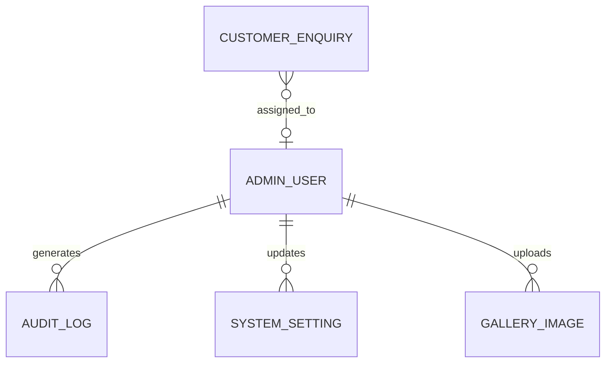

# EVRE Charging Hub: Database Design Specifications
*Prepared by Antigravity MongoDB Database Engineering Group*

This document outlines the detailed database schemas, validation frameworks, relational mappings, and index strategies for the EVRE Charging Hub backend using **Mongoose / MongoDB**.

---

## 1. Database Entity-Relationship Mapping

The diagram below shows the relationships between core entities:



---

## 2. Collections Specifications

### 2.1 Contact Form submissions (`contact_forms`)
Handles basic public contact messages.

- **Indexes:**
  - `email` (Ascending) - for quick filtering by email.
  - `status` (Ascending) - for dashboard filtering.
  - `createdAt` (Descending) - for chronological list rendering.

#### Mongoose Schema Code
```javascript
const mongoose = require('mongoose');

const ContactFormSchema = new mongoose.Schema({
  name: {
    type: String,
    required: [true, 'Name is required'],
    trim: true,
    maxlength: [100, 'Name cannot exceed 100 characters']
  },
  email: {
    type: String,
    required: [true, 'Email is required'],
    trim: true,
    lowercase: true,
    match: [/^\w+([\.-]?\w+)*@\w+([\.-]?\w+)*(\.\w{2,3})+$/, 'Please fill a valid email address']
  },
  subject: {
    type: String,
    required: [true, 'Subject is required'],
    trim: true,
    maxlength: [150, 'Subject cannot exceed 150 characters']
  },
  message: {
    type: String,
    required: [true, 'Message body is required'],
    trim: true,
    maxlength: [2000, 'Message cannot exceed 2000 characters']
  },
  status: {
    type: String,
    enum: {
      values: ['pending', 'in-progress', 'resolved', 'ignored'],
      message: 'Status must be pending, in-progress, resolved, or ignored'
    },
    default: 'pending',
    index: true
  },
  ipAddress: {
    type: String,
    trim: true
  }
}, {
  timestamps: true // Auto-generates createdAt and updatedAt
});

// Compound Index for admin inbox filters
ContactFormSchema.index({ status: 1, createdAt: -1 });

module.exports = mongoose.model('ContactForm', ContactFormSchema);
```

---

### 2.2 Customer Enquiries (`customer_enquiries`)
Captures targeted B2B lead records (Fleet Accounts and Host Partnerships).

- **Relationships:**
  - `assignedTo` maps to `AdminUser` (`_id`).
- **Indexes:**
  - `enquiryType` (Ascending)
  - `status` (Ascending)
  - `assignedTo` (Ascending)

#### Mongoose Schema Code
```javascript
const mongoose = require('mongoose');

const CustomerEnquirySchema = new mongoose.Schema({
  enquiryType: {
    type: String,
    required: [true, 'Enquiry type is required'],
    enum: ['fleet', 'host', 'partnership'],
    index: true
  },
  companyName: {
    type: String,
    required: [true, 'Company name is required'],
    trim: true
  },
  contactPerson: {
    type: String,
    required: [true, 'Contact person name is required'],
    trim: true
  },
  email: {
    type: String,
    required: [true, 'Email is required'],
    trim: true,
    lowercase: true,
    match: [/^\w+([\.-]?\w+)*@\w+([\.-]?\w+)*(\.\w{2,3})+$/, 'Please fill a valid email address']
  },
  phone: {
    type: String,
    required: [true, 'Phone number is required'],
    trim: true
  },
  details: {
    // Fleet Specific Data
    vehicleCount: { type: Number, min: [1, 'Vehicle count must be at least 1'] },
    estimatedMonthlyKwh: { type: Number },
    // Host Specific Data
    parkingSpaces: { type: Number, min: [0, 'Parking spaces cannot be negative'] },
    propertyOwnership: { type: String, enum: ['owned', 'leased', 'managing-agent'] },
    // Additional Notes
    notes: { type: String, maxlength: 1000 }
  },
  assignedTo: {
    type: mongoose.Schema.Types.ObjectId,
    ref: 'AdminUser',
    default: null,
    index: true
  },
  status: {
    type: String,
    enum: ['new', 'contacted', 'negotiating', 'qualified', 'closed-won', 'closed-lost'],
    default: 'new',
    index: true
  }
}, {
  timestamps: true
});

CustomerEnquirySchema.index({ enquiryType: 1, status: 1 });

module.exports = mongoose.model('CustomerEnquiry', CustomerEnquirySchema);
```

---

### 2.3 Testimonials (`testimonials`)
Stores client testimonials displayed on public sections.

- **Validation Rules:**
  - `rating` must be an integer between 1 and 5.
- **Indexes:**
  - `isApproved` and `featured` (Compound Index) - allows rapid lookup for landing page sliders.

#### Mongoose Schema Code
```javascript
const mongoose = require('mongoose');

const TestimonialSchema = new mongoose.Schema({
  authorName: {
    type: String,
    required: [true, 'Author name is required'],
    trim: true
  },
  avatarUrl: {
    type: String,
    default: '/assets/default-avatar.png'
  },
  evModel: {
    type: String,
    trim: true,
    placeholder: 'e.g., Tesla Model 3'
  },
  ecoImpactBadge: {
    type: String,
    trim: true,
    placeholder: 'e.g., Saved 350kg CO2'
  },
  rating: {
    type: Number,
    required: [true, 'Rating is required'],
    min: [1, 'Rating must be at least 1'],
    max: [5, 'Rating cannot exceed 5']
  },
  quote: {
    type: String,
    required: [true, 'Quote content is required'],
    trim: true,
    maxlength: [500, 'Quote cannot exceed 500 characters']
  },
  isApproved: {
    type: Boolean,
    default: false,
    index: true
  },
  featured: {
    type: Boolean,
    default: false,
    index: true
  }
}, {
  timestamps: true
});

// Optimization for frontend rendering fetches
TestimonialSchema.index({ isApproved: 1, featured: -1, createdAt: -1 });

module.exports = mongoose.model('Testimonial', TestimonialSchema);
```

---

### 2.4 Services (`services`)
Manages offerings at EVRE charging facilities.

- **Indexes:**
  - `slug` (Unique Index) - for clean dynamic routing URLs.

#### Mongoose Schema Code
```javascript
const mongoose = require('mongoose');

const ServiceSchema = new mongoose.Schema({
  title: {
    type: String,
    required: [true, 'Service title is required'],
    trim: true,
    unique: true
  },
  slug: {
    type: String,
    required: true,
    unique: true,
    lowercase: true,
    index: true
  },
  iconName: {
    type: String,
    required: [true, 'Icon reference is required'],
    trim: true
  },
  description: {
    type: String,
    required: [true, 'Description is required'],
    trim: true
  },
  features: [{
    type: String,
    trim: true
  }],
  category: {
    type: String,
    required: true,
    enum: ['charging', 'lifestyle', 'b2b'],
    default: 'charging'
  },
  isActive: {
    type: Boolean,
    default: true,
    index: true
  }
}, {
  timestamps: true
});

module.exports = mongoose.model('Service', ServiceSchema);
```

---

### 2.5 Gallery Images (`gallery_images`)
Stores metadata of images showcased in lounges and stations.

- **Relationships:**
  - `uploadedBy` maps to `AdminUser` (`_id`).

#### Mongoose Schema Code
```javascript
const mongoose = require('mongoose');

const GalleryImageSchema = new mongoose.Schema({
  title: {
    type: String,
    required: [true, 'Image title is required'],
    trim: true
  },
  url: {
    type: String,
    required: [true, 'Image URL is required']
  },
  altText: {
    type: String,
    required: [true, 'Alt text is required'],
    trim: true
  },
  category: {
    type: String,
    required: true,
    enum: ['lounge', 'station', 'event', 'general'],
    default: 'general',
    index: true
  },
  uploadedBy: {
    type: mongoose.Schema.Types.ObjectId,
    ref: 'AdminUser',
    required: true
  }
}, {
  timestamps: true
});

module.exports = mongoose.model('GalleryImage', GalleryImageSchema);
```

---

### 2.6 Admin Dashboard Core Entities

To power the security, auditing, and system setting configurations of the Admin Dashboard:

#### Admin Users Schema (`admin_users`)
```javascript
const mongoose = require('mongoose');

const AdminUserSchema = new mongoose.Schema({
  name: {
    type: String,
    required: [true, 'Admin name is required'],
    trim: true
  },
  email: {
    type: String,
    required: [true, 'Email is required'],
    unique: true,
    lowercase: true,
    trim: true,
    index: true
  },
  passwordHash: {
    type: String,
    required: true
  },
  role: {
    type: String,
    enum: ['superadmin', 'moderator', 'support'],
    default: 'support'
  },
  isActive: {
    type: Boolean,
    default: true,
    index: true
  },
  lastLoginAt: {
    type: Date
  }
}, {
  timestamps: true
});

module.exports = mongoose.model('AdminUser', AdminUserSchema);
```

#### Audit Logs Schema (`audit_logs`)
Captures all critical administrative actions for security tracking.
```javascript
const mongoose = require('mongoose');

const AuditLogSchema = new mongoose.Schema({
  adminId: {
    type: mongoose.Schema.Types.ObjectId,
    ref: 'AdminUser',
    required: true,
    index: true
  },
  action: {
    type: String,
    required: true, // e.g., 'TESTIMONIAL_APPROVE', 'SETTINGS_UPDATE'
    index: true
  },
  targetCollection: {
    type: String,
    required: true // e.g., 'testimonials'
  },
  targetId: {
    type: mongoose.Schema.Types.ObjectId,
    required: true
  },
  details: {
    type: mongoose.Schema.Types.Mixed // Stores JSON state changes
  },
  ipAddress: {
    type: String
  }
}, {
  timestamps: { createdAt: true, updatedAt: false } // Only tracks creation
});

// Chronological audit queries optimization
AuditLogSchema.index({ adminId: 1, createdAt: -1 });

module.exports = mongoose.model('AuditLog', AuditLogSchema);
```

#### System Settings Schema (`system_settings`)
Allows admins to update dynamic variables on the site without editing code.
```javascript
const mongoose = require('mongoose');

const SystemSettingSchema = new mongoose.Schema({
  key: {
    type: String,
    required: true,
    unique: true,
    index: true // e.g., 'GLOBAL_CO2_MULTIPLIER', 'MAINTENANCE_BANNER_TEXT'
  },
  value: {
    type: mongoose.Schema.Types.Mixed,
    required: true
  },
  description: {
    type: String,
    trim: true
  },
  updatedBy: {
    type: mongoose.Schema.Types.ObjectId,
    ref: 'AdminUser'
  }
}, {
  timestamps: true
});

module.exports = mongoose.model('SystemSetting', SystemSettingSchema);
```

---
*End of Database Design Specification. Ready for physical initialization.*
