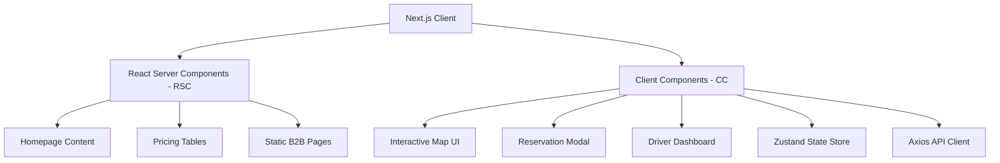
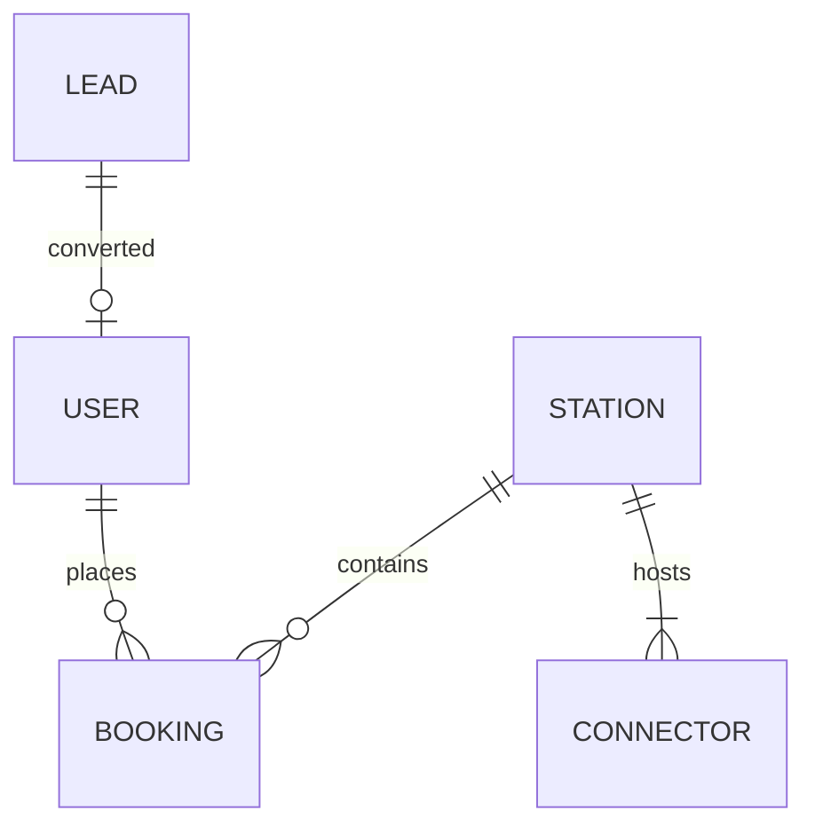

# EVRE Charging Hub: Project Architecture Specifications
*Prepared by Antigravity Senior Full-Stack Architect Team*

This document defines the production-ready software architecture, database design, directory layouts, and security configurations for the **EVRE Charging Hub** web and mobile backend ecosystem.

---

## 1. Directory & Folder Structure

We implement a modular, decoupled architecture with a `/client` folder (Next.js 15 App Router) and a `/server` folder (Node.js/Express API).

```
FUTURE_FS_03/
├── client/                      # Next.js 15 Frontend
│   ├── public/                  # Static assets (logos, icons, map-pins)
│   └── src/
│       ├── app/                 # Next.js App Router (RSC-first)
│       │   ├── layout.js        # Global layout (providers, fonts, styles)
│       │   ├── page.js          # Homepage
│       │   ├── locator/         # Find a Charger Map (/locator)
│       │   ├── solutions/       # B2B landing pages
│       │   ├── pricing/         # Tariff and subscription pages
│       │   └── dashboard/       # Driver authenticated portal
│       ├── components/          # Reusable UI Components
│       │   ├── ui/              # Atom level elements (buttons, inputs, glass cards)
│       │   ├── map/             # Map engine wrapper (Leaflet/Mapbox)
│       │   └── layout/          # Navbar, Footer, Drawers
│       ├── hooks/               # Custom React hooks (useMap, useAuth)
│       ├── services/            # Client API client (Axios + interceptors)
│       ├── store/               # Global state management (Zustand)
│       └── utils/               # Formatting, coordinate helpers, validation
│
├── server/                      # Node.js + Express Backend
│   ├── config/                  # Database & environment keys (db.js, env.js)
│   ├── controllers/             # Express controllers (auth, booking, station, lead)
│   ├── middleware/              # Auth guards, security checks, rate limiters
│   ├── models/                  # Mongoose Schemas (User, Station, Booking, Lead)
│   ├── routes/                  # Express routes mapped to controllers
│   ├── services/                # Integration services (Stripe, Twilio, NodeMailer)
│   ├── utils/                   # Shared backend helpers (errors, logger)
│   ├── server.js                # Server initialization & Socket.io mount
│   └── package.json
│
└── README.md                    # Project blueprint and progress logs
```

---

## 2. Frontend Architecture (Next.js)

The frontend is built on **Next.js 15 (App Router)** utilizing **React Server Components (RSC)** for optimal load speeds, SEO performance, and security.



- **Server vs. Client Components:**
  - *RSC (Default):* Homepage copy, blog posts, pricing grids, and B2B pages. Rendered server-side with zero JS impact.
  - *Client Components (`"use client"`):* Interactive Locator Map, booking forms, live calculators, and driver profile graphs.
- **State Management:** **Zustand** is used for client state (active maps, filters, user tokens) due to its minimal footprint and ease of server-side hydration matching.
- **Styling:** CSS variables defined in a global design token style sheet, matching tailwind configs if Tailwind CSS is used.

---

## 3. Backend Architecture (Node.js & Express)

The backend is built as a stateless **Express.js API** backed by **Node.js**, prioritizing speed, scalable REST patterns, and real-time support.

- **Request-Response Flow:**
  - Route handlers define endpoints and map to controller methods.
  - Custom middleware checks authentication (JWT), rates limits requests, and validates input data.
  - Controllers contain request routing and delegation; service classes manage core business logic (e.g. email dispatches, database operations).
- **Real-Time Synchronizations:** **Socket.io** handles persistent connections with chargers and clients, updating charger availability state instantly when charger hardware updates.

---

## 4. Database Architecture (MongoDB & Mongoose)

We utilize a structured MongoDB database with relations managed via Mongoose schemas. 



### Database Schemas

#### 1. User Schema (`users`)
Tracks account profiles, charging history, and loyalty parameters.
```javascript
{
  name: { type: String, required: true },
  email: { type: String, required: true, unique: true, index: true },
  passwordHash: { type: String, required: true },
  role: { type: String, enum: ['driver', 'fleet_manager', 'host', 'admin'], default: 'driver' },
  rfidTag: { type: String, unique: true, sparse: true },
  ecoMetrics: {
    co2SavedKg: { type: Number, default: 0 },
    totalChargedKwh: { type: Number, default: 0 }
  },
  createdAt: { type: Date, default: Date.now }
}
```

#### 2. Station Schema (`stations`)
Contains physical locations, geographic coordinates, and connector lists.
```javascript
{
  name: { type: String, required: true },
  address: { type: String, required: true },
  location: {
    type: { type: String, default: 'Point' },
    coordinates: { type: [Number], required: true } // [longitude, latitude]
  },
  connectors: [{
    connectorId: { type: String, required: true },
    type: { type: String, enum: ['CCS', 'NACS', 'CHAdeMO', 'Type2'], required: true },
    powerKW: { type: Number, required: true },
    status: { type: String, enum: ['available', 'occupied', 'offline', 'reserved'], default: 'available' },
    activeBookingId: { type: mongoose.Schema.Types.ObjectId, ref: 'Booking', default: null }
  }],
  amenities: [{ type: String }],
  baseTariffPerKwh: { type: Number, required: true },
  isGreenCertified: { type: Boolean, default: true }
}
// Indexing
stationSchema.index({ location: '2dsphere' }); // Geo-spatial search
```

#### 3. Booking Schema (`bookings`)
Manages driver reservations and pricing reports.
```javascript
{
  userId: { type: mongoose.Schema.Types.ObjectId, ref: 'User', required: true, index: true },
  stationId: { type: mongoose.Schema.Types.ObjectId, ref: 'Station', required: true, index: true },
  connectorId: { type: String, required: true },
  startTime: { type: Date, required: true },
  endTime: { type: Date, required: true },
  status: { type: String, enum: ['pending', 'confirmed', 'charging', 'completed', 'cancelled'], default: 'pending' },
  financials: {
    costEstimate: { type: Number },
    actualCost: { type: Number }
  },
  carbonSavedKg: { type: Number, default: 0 }
}
```

#### 4. Lead Schema (`leads`)
Captures B2B conversion profiles (Host-a-Hub / Fleets).
```javascript
{
  leadType: { type: String, enum: ['fleet', 'host'], required: true },
  companyName: { type: String, required: true },
  contactPerson: { type: String, required: true },
  email: { type: String, required: true },
  phone: { type: String, required: true },
  details: {
    parkingSpaces: { type: Number }, // For Hosts
    vehicleCount: { type: Number },  // For Fleets
    notes: { type: String }
  },
  status: { type: String, enum: ['new', 'contacted', 'qualified', 'closed'], default: 'new' },
  createdAt: { type: Date, default: Date.now }
}
```

---

## 5. API Routing Architecture

All Express routes live under `/api/v1/` and return structured JSON responses:

### REST API Mappings

| Method | Endpoint | Auth Level | Description |
| :--- | :--- | :--- | :--- |
| **POST** | `/api/v1/auth/register` | Public | Account creation. |
| **POST** | `/api/v1/auth/login` | Public | Login; returns JWT access token & sets HTTP-only refresh cookie. |
| **POST** | `/api/v1/auth/logout` | User | Clears sessions & token blacklists. |
| **GET** | `/api/v1/auth/me` | User | Returns authenticated user dashboard profile metrics. |
| **GET** | `/api/v1/stations` | Public | Returns stations. Supports Query: `?lat={lat}&lng={lng}&radius={meters}`. |
| **GET** | `/api/v1/stations/:id` | Public | Dynamic routing for specific station detail views. |
| **POST** | `/api/v1/bookings/create` | User | Schedules a charger reservation. |
| **PUT** | `/api/v1/bookings/:id/cancel` | User | Cancels reservation. |
| **POST** | `/api/v1/leads` | Public | Submits B2B lead generation forms (fleet/host). |

---

## 6. Authentication Plan

Authentication is stateless, utilizing a **Double-Token JWT Strategy** to balance speed, security, and session management.

- **Access Token:** Short-lived JWT (15-minute expiration), passed in the HTTP Authorization header (`Bearer <Token>`). Contains user ID and RBAC roles.
- **Refresh Token:** Long-lived JWT (7-day expiration), stored inside a secure cookie:
  - `HttpOnly: true` (Protects against XSS token extraction).
  - `Secure: true` (Ensures transmission over HTTPS only).
  - `SameSite: Strict` (Protects against CSRF attacks).
- **Role-Based Access Control (RBAC):** Middleware checks route authorization tags. E.g., `checkRole(['admin'])` shields API creation of stations.

---

## 7. Deployment Infrastructure Plan

Our multi-service deployment pipeline ensures rapid updates, global content caching, and elastic scalability.

```
                  [ GITHUB REPOSITORY ]
                            |
           +----------------+----------------+
           | (Next.js CI)                    | (Express/Node CI)
           v                                 v
      [ VERCEL CDN ]                  [ RENDER CONTAINER ]
     (Static Edge Files)            (Elastic Backend Instances)
           |                                 |
           | (JSON API Queries)              | (Queries / Mongoose)
           +---------------->                v
                                    [ MONGO ATLAS CLOUD ]
                                    (Global Multi-Region DB)
```

- **Frontend Hosting:** **Vercel**
  - Edge caching optimizes Next.js core assets worldwide.
- **Backend Hosting:** **Render** (or AWS Elastic Beanstalk)
  - Automatic scaling configurations dynamically boot backend instances based on CPU usage indicators.
- **Database Hosting:** **MongoDB Atlas**
  - Multi-region replication ensures low latency and automated failover recovery.
- **CI/CD Pipeline:** Github Action triggers automation:
  - PR/Merge -> Code Lints -> Jest Unit Tests -> Auto Deploy to Production environments.

---

## 8. SEO Plan

To achieve top placement on search engine result pages (SERPs) for local EV charging queries:

- **Next.js Metadata Integration:** Automatic creation of semantic meta title and description attributes mapped inside dynamically rendered Server Components.
- **Local Structured Schema Markup:** Dynamically inject `ChargingStation` JSON-LD structures on station detail pages, allowing Google to display live charger counts directly in local search result panels.
- **Dynamic Sitemap:** Cron execution creates `/sitemap.xml` daily, linking standard landing pages and dynamic `/hubs/[slug]` router links.
- **Robots.txt Control:** Exclude indexation of internal pages like `/dashboard` and configuration panels while prioritizing site content pages.

---

## 9. Performance Optimization Plan

- **Static Generation with Dynamic Revalidation (ISR):** Station detail routes (`/locator/[station-id]`) are pre-generated as static pages. On request, dynamic content refreshes in the background every 5 minutes (`revalidate: 300`).
- **Media Optimization:** Next.js `<Image />` component converts large PNG asset libraries into compressed WebP formats on deployment.
- **MongoDB Geo-Queries:** Heavy geolocation lookups leverage optimized `2dsphere` indexes, executing computations directly inside Atlas memory before returning values to the API controllers.
- **HTTP Compression:** Gzip/Brotli payload compression enabled on the Express server level reduces payload transfer sizes by up to 70%.

---

## 10. Security Hardening Plan

> [!WARNING]
> Production release configurations must mandate the following security safeguards:

- **Helmet.js Protection:** Mounted Express middleware sets secure HTTP headers (Strict-Transport-Security, X-Frame-Options, X-Content-Type-Options).
- **NoSQL Injection Block:** Validation rules and `express-mongo-sanitize` sanitize query fields, stripping dangerous Mongo properties like `$gt` or `$ne`.
- **Zod Data Schema Validation:** Input validation executed at route level. Incoming payloads must comply with exact data types before reaching controller code blocks.
- **Strict Rate Limiting:** Limits sensitive paths (e.g. 5 auth requests/minute per IP, 10 booking requests/minute).
- **CORS Constraints:** API routes whitelist specific client domain URLs, rejecting cross-origin calls from unregistered websites.

---
*End of Project Architecture Specification. Ready for Backend Setup.*
